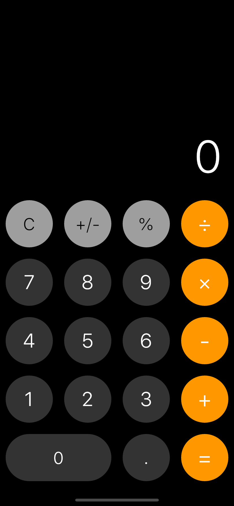
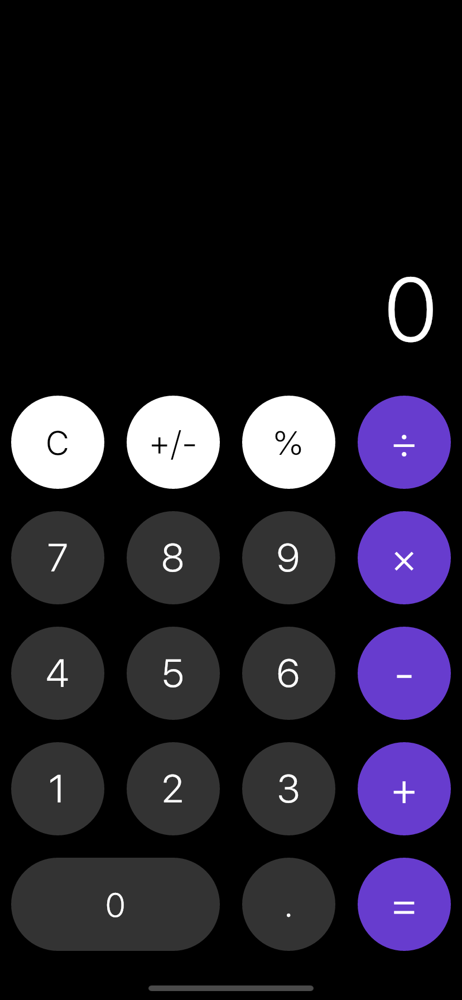
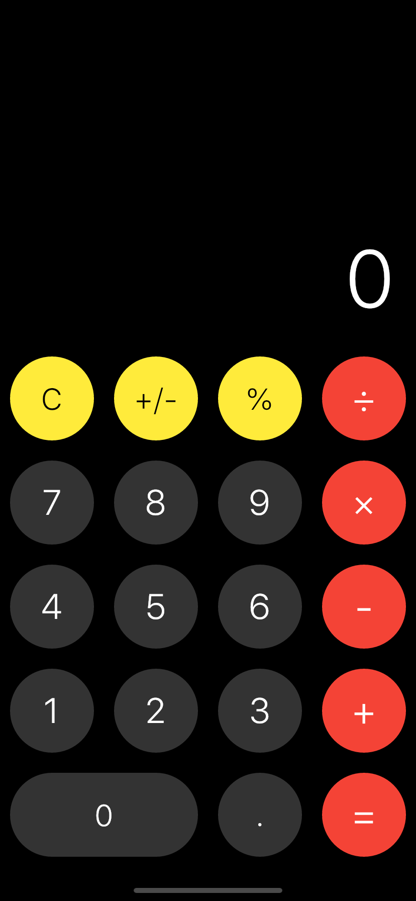
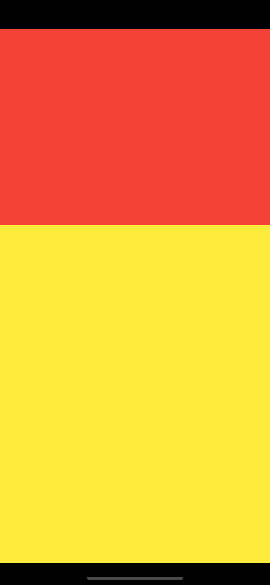
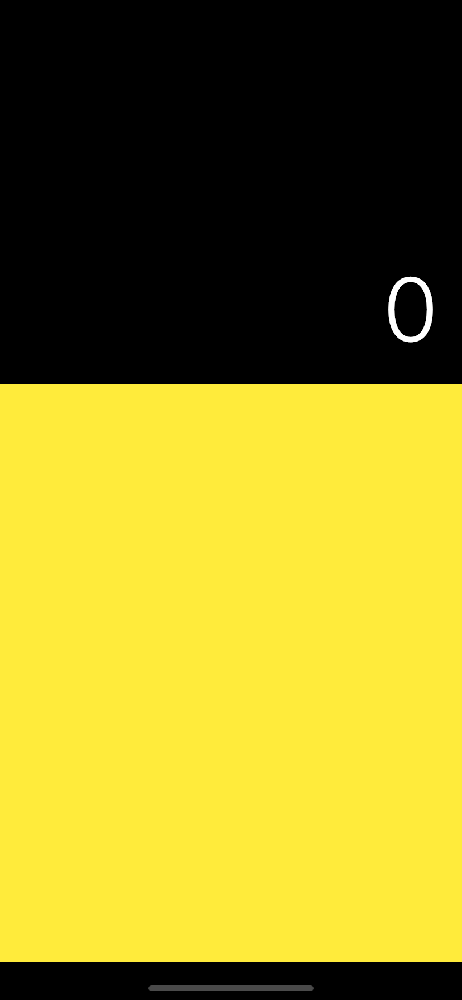
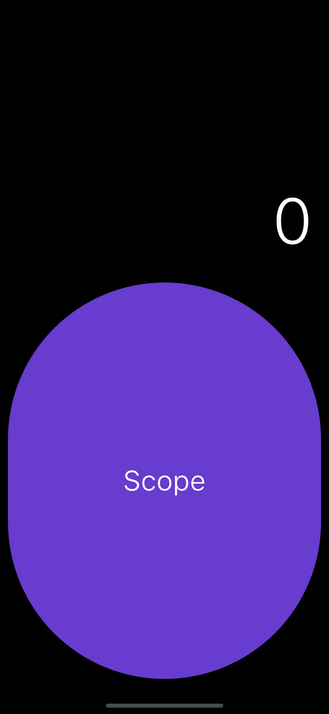

# Lesson 3 - Calculator: Containers, Layouts & States
In this lesson, we will replicate iOS's built-in calculator. You will learn about how to create the layout of your app and style them as well as how to utilize stateful widgets to add logic to your app. Checkout the screenshots below!

&nbsp;&nbsp;&nbsp;&nbsp;


Before we get started, we need to do a quick review of widgets (and introduce you to many new ones).

### MaterialApp
The root(top-level) widget of a material app. It provides us support for navigators and themes. We use MaterialApp because we develop apps with [Google's Material](https://material.io/) design. There is also another root level widget called CupertinoApp which you can use if you want to develop iOS looking apps.

### Material
The Material widget provides support for defining UI rules. It's recommended to put either the Material widget or the Scaffold widget as the first widget under the home parameter of the MaterialApp widget.

### SafeArea
Defines a safearea for you to render UI widgets in. Some devices, like the iPhone X, have a notch on top which can hinder the device canvas if you are not careful. Putting your widgets in a SafeArea ensures that everything you render on the screen can be seen by the users.

### Text
Renders some text. You can also style them.

### Container
Equivalent to `div` in HTML. It is a general-purpose widget that has several attributes you can change and style (width, height, padding, margin, color, border radius, child...). You can put content inside the container by defining widgets in its child parameter.

### Row/Column
Defines a row/column layout in which you can also define the layout of its child widgets. This is similar to CSS's flexbox with `flex-direction: row/column`. You change the layout of its child widgets by defining the `mainAxisAlignment` and `crossAxisAlignment` parameters.

### FittedBox
Ensures that if the size of the child will not overflow/exceed the size of this widget. If the child overflows, the FittedBox widget shrinks the child accordinly.

### Expanded
Can only be used as the direct child of `Row/Column` widgets. The size of this widget takes up the remaining space (expands to fill the remaining space in the row/column). It's like setting `flex: 1` in `CSS`

### AspectRatio
This widget maintains a aspect ratio which you specify.

### Center
A widget that centers its children.

### Button
Literally a button 😂

PHEW! I know that was a lot of information to absorb. Don't worry if you can't remember all of them. We will cover them more in-depth as we use them!

## Part 1 - Defining the look (How the calculator looks)
Start by creating a new flutter project. Delete `MyHomePage` and `_MyHomePageState` class. Define the follow class `MainPage`:

```dart
class MainPage extends StatelessWidget {
  @override
  Widget build(BuildContext context) {
    return Material(
      child: Container(
        color: Colors.black,
        child: SafeArea(
          child: Container(
            decoration: BoxDecoration(
              color: Colors.red,
            ),
          ),
        ),
      ),
    );
  }
}
```

also make your `MyApp` class like the following
```dart
class MyApp extends StatelessWidget {
  @override
  Widget build(BuildContext context) {
    return MaterialApp(
      title: 'Calculator',
      debugShowCheckedModeBanner: false,
      home: MainPage(),
    );
  }
}
```

At this point you should have successfully drawn red `SafeArea` in a black canvas! We are going to draw our calculator widgets inside the `SafeArea` widget in `MainPage`, so that our UI can render without any obstructions.


Now let us think about how to structure the layout of our app. You can see that the iOS calculator has a 4x5 grid of buttons. Therefore, we define a `AspectRatio` widget with the aspect ratio `4 / 5`, because the ratio of width:height is 4:5. We also define an `Expanded` widget to make the calculator result display to fill the rest of the screen. Both `Expanded` and `AspectRatio` widgets should be children of a `Column` widget, because our app has a vertical layout.

Change the build function of MainPage to:
```dart
@override
Widget build(BuildContext context) {
  return Material(
    child: Container(
      color: Colors.black,
      child: SafeArea(
        child: Column(
          children: <Widget>[
            Expanded(
              child: Container(
                decoration: BoxDecoration(
                  color: Colors.red,
                ),
              ),
            ),
            AspectRatio(
              aspectRatio: 1 / 5 * 4,
              child: Container(
                decoration: BoxDecoration(
                  color: Colors.yellow,
                ),
              ),
            )
          ],
        ),
      ),
    ),
  );
}
```
You should see that the screen has been separated into a red area and a yellow area. We will make the red area display the calculator output and the yellow area display the buttons.



Let's first display the calculator output. Change the Expanded widget to the following
```dart
Expanded(
  child: Container(
    width: double.infinity,
    height: double.infinity,
    padding: EdgeInsets.all(20),
    child: Column(
      mainAxisAlignment: MainAxisAlignment.end,
      crossAxisAlignment: CrossAxisAlignment.end,
      children: <Widget>[
        FittedBox(
          child: Text(
            '0',
            style: TextStyle(
              fontSize: 80,
              color: Colors.white,
              fontWeight: FontWeight.w200,
            ),
          ),
        ),
      ],
    ),
  ),
),
```



We put a `Container` widget inside the `Expanded` widget. The `Container` has the same size as the `Expanded` because we set both of its width and height to infinity. The `Container` also has a padding of `20` units. Next, we displayed a hardcoded `0` as our calculator output. The `0` is shown in the bottom-right corner because we defined a column with both of its `mainAxisAlignment` and `crossAxisAlignment` set to `end`. We also made sure that the calculator output does not overflow the screen by putting the `Text` widget inside a `FittedBox` widget. Finally, we also gave the `Text` widget a color, size, and boldness.

Now all we need to do is to display the actual buttons. Let's start by defining a Button class:

```dart
class Button extends StatelessWidget {

  final Color bgColor;
  final Color textColor;
  final double textSize;
  final String text;

  Button({Key key, 
    this.bgColor, 
    this.textColor, 
    this.text, 
    this.textSize
  }) : super(key: key);

  @override
  Widget build (BuildContext context) {
    return Container(
      margin: EdgeInsets.all(10),
      width: double.infinity,
      height: double.infinity,
      decoration: BoxDecoration(
        borderRadius: BorderRadius.circular(1000),
        color: this.bgColor,
      ),
      child: Center(
        child: Text(
          this.text,
          style: TextStyle(
            fontSize: this.textSize,
            color: this.textColor,
            fontWeight: FontWeight.w200,
          ),
        ),
      ),
    );
  }
}
```

We built a custom widget called `Button`. You should have already seen most of the widgets used in this class. Some new features we have used here are that we gave the `Container` a margin of 10 units and added background color and border radius decorations to it. We made the border radius very large (1000) so that the button appears to be a circle. In addition, the background color, text color, text, and text size are all parameters passed into this `Button`'s constructor.

Let's see if the `Button` widget works. Replace the `AspectRatio` widget we defined earlier to the following:

```dart
AspectRatio(
  aspectRatio: 1 / 5 * 4,
  child: Button(bgColor: Color.fromARGB(255, 103, 60, 206),
  textColor: Colors.white, text: "Scope", textSize: 35),
)
```



Looks good! Before we add the buttons, let's do one more thing. Define the color and text of the buttons as parameters of `MainPage`, so we can easily change the theme of our calculator later.

Add the following before the `build` function of `MainPage`:
```dart
final Color opColor;
final Color opTextColor;
final Color utilColor;
final Color utilTextColor;
final Color numColor;
final Color numTextColor;

MainPage({Key key,
  @required this.opColor,
  @required this.opTextColor,
  @required this.utilColor,
  @required this.utilTextColor,
  @required this.numColor,
  @required this.numTextColor,
}) : super(key: key);
```

Also change our `MainPage` initialization in `MyApp` to 
```dart
MainPage(
  opColor: Color.fromARGB(255, 103, 60, 206),
  opTextColor: Colors.white,
  utilColor: Colors.grey,
  utilTextColor: Colors.black,
  numColor: Color.fromARGB(255, 51, 51, 51),
  numTextColor: Colors.white,
),
```

We are successfully setup the theme of the calculator, now ;et's add the actual buttons. Change the `AspectRatio` initialization to:
```dart
AspectRatio(
  aspectRatio: 1 / 5 * 4,
  child: Column(
    children: <Widget>[
      Expanded(
        child: Row(
          children: <Widget>[
            Expanded(
              child: Button(bgColor: this.utilColor, textColor: this.utilTextColor, text: "C", textSize: 30),
            ),
            Expanded(
              child: Button(bgColor: this.utilColor, textColor: this.utilTextColor, text: "+/-", textSize: 30),
            ),
            Expanded(
              child: Button(bgColor: this.utilColor, textColor: this.utilTextColor, text: "%", textSize: 30),
            ),
            Expanded(
              child: Button(bgColor: this.opColor, textColor: this.opTextColor,  text: "÷", textSize: 40),
            ),
          ],
        ),
      ),
      Expanded(
        child: Row(
          children: <Widget>[
            Expanded(
              child: Button(bgColor: this.numColor, textColor: this.numTextColor, text: "7", textSize: 35),
            ),
            Expanded(
              child: Button(bgColor: this.numColor, textColor: this.numTextColor, text: "8", textSize: 35),
            ),
            Expanded(
              child: Button(bgColor: this.numColor, textColor: this.numTextColor, text: "9", textSize: 35),
            ),
            Expanded(
              child: Button(bgColor: this.opColor, textColor: this.opTextColor, text: "×", textSize: 40),
            ),
          ],
        ),
      ),
      Expanded(
        child: Row(
          children: <Widget>[
            Expanded(
              child: Button(bgColor: this.numColor, textColor: this.numTextColor, text: "4", textSize: 35),
            ),
            Expanded(
              child: Button(bgColor: this.numColor, textColor: this.numTextColor, text: "5", textSize: 35),
            ),
            Expanded(
              child: Button(bgColor: this.numColor, textColor: this.numTextColor, text: "6", textSize: 35),
            ),
            Expanded(
              child: Button(bgColor: this.opColor, textColor: this.opTextColor, text: "-", textSize: 40),
            ),
          ],
        ),
      ),
      Expanded(
        child: Row(
          children: <Widget>[
            Expanded(
              child: Button(bgColor: this.numColor, textColor: this.numTextColor, text: "1", textSize: 35),
            ),
            Expanded(
              child: Button(bgColor: this.numColor, textColor: this.numTextColor, text: "2", textSize: 35),
            ),
            Expanded(
              child: Button(bgColor: this.numColor, textColor: this.numTextColor, text: "3", textSize: 35),
            ),
            Expanded(
              child: Button(bgColor: this.opColor, textColor: this.opTextColor, text: "+", textSize: 40),
            ),
          ],
        ),
      ),
      Expanded(
        child: Row(
          children: <Widget>[
            Flexible(
              flex: 2,
              child: Button(bgColor: this.numColor, textColor: this.numTextColor, text: "0", textSize: 30),
            ),
            Flexible(
              flex: 1,
              child: Button(bgColor: this.numColor, textColor: this.numTextColor, text: ".", textSize: 30),
            ),
            Flexible(
              flex: 1,
              child: Button(bgColor: this.opColor, textColor: this.opTextColor, text: "=", textSize: 40),
            ),
          ],
        ),
      ),
    ],
  ),
)
```

That seems like a lot of code...but actually we just defined a grid with some buttons :)


Congratulations! Now you should see the UI of a calculator on your screen!
## Part 2 - Adding the logic (How the calculator works)
We are going to use states in this part of the lesson. Since we originally defined our `MainPage` as a `StatelessWidget`, we need to convert it into a `StatefulWidget`. Android Studio actually has a quick shortcut. Hover your cursor on `MainPage`, click the light bulb, and you should see an option to convert `MainPage` to a `StatefulWidget`. Interestingly, you see that the parameters we defined in the original `MainPage` stayed in the `MainPage`, while the build method has been moved to a new class called `MainPageState`. As a result, the paramters we used before like `this.utilColor` has also been changed to `this.widget.utilColor` automatically. Cool!

Right now, our buttons are merely `Container`s, so they are just some static graphics. We need to make them clickable by adding a `GestureDetector`. Firstly, let's define an callback called `onTap` in `Button`. The value of `onTap` will be passed in through `Button`'s constructor:

```dart
final Color bgColor;
final Color textColor;
final double textSize;
final String text;
final void Function() onTap; // declare member variable

Button({Key key,
  this.bgColor,
  this.textColor,
  this.text,
  this.textSize,
  this.onTap,    // get value through Button constructor
}) : super(key: key);
```

We should also change the `build` function of the `Button` class to the following.

```dart
@override
Widget build (BuildContext context) {
  return GestureDetector(
    onTap: this.onTap,
    child: Container(
      margin: EdgeInsets.all(10),
      width: double.infinity,
      height: double.infinity,
      decoration: BoxDecoration(
        borderRadius: BorderRadius.circular(1000),
        color: this.bgColor,
      ),
      child: Center(
        child: Text(
          this.text,
          style: TextStyle(
            fontSize: this.textSize,
            color: this.textColor,
            fontWeight: FontWeight.w200,
          ),
        ),
      ),
    ),
  );
}
```

All we did is to wrap the entire button widgets in a `GestureDetector` and link the `onTap` action of `GestureDetector` to our `Button`'s `onTap` action. Everything should still compile and run without any visual changes.

Now we can finally add the calculator logic to the buttons! The logic of a calculator is actually fairly complicated, so we are making a simplified version here just to demonstrate that the buttons work. It works in general, but there are some bugs in some edge cases and some more advanced features are missing. Feel free to implement them on your own!

Add the following memeber variables and functions to your `MainPageState`:

```dart
double prev = 0;
double curr = 0;
String operator = '+';
int decimalOffset = 0;

onNumTap(int num) {
  setState(() {
    if(decimalOffset == 0) {
      this.curr = this.curr * 10 + num;
    } else {
      this.curr = this.curr + num * pow(10, -decimalOffset);
      ++this.decimalOffset;
    }
  });
}

onDecimalTap() {
  setState(() {
    if(this.decimalOffset == 0) {
      this.decimalOffset = 1;
    }
  });
}

onOperatorTap(String operator) {
  setState(() {
    this.operator = operator;
    this.prev = this.curr;
    this.curr = 0;
    this.decimalOffset = 0;
  });
}

onClearTap() {
  setState(() {
    this.prev = 0;
    this.curr = 0;
    this.operator = '+';
    this.decimalOffset = 0;
  });
}

onEqualTap() {
  setState((){
    switch(this.operator) {
      case '+':
        this.curr = this.prev + this.curr;
        break;
      case '-':
        this.curr = this.prev - this.curr;
        break;
      case '*':
        this.curr = this.prev * this.curr;
        break;
      case '/':
      default:
        this.curr = this.prev / this.curr;
        break;
    }
  });
}

onNegateTap() {
  setState(() {
    this.curr *= -1;
  });
}

onPercentTap() {
  setState(() {
    this.curr /= 100;
  });
}
```

The functions are self-explanatory. Now let's connect these functions to our buttons. Rewrite the `AspectRatio` widget in the `build` function of `MainPageState`:

```dart
AspectRatio(
  aspectRatio: 1 / 5 * 4,
  child: Column(
    children: <Widget>[
      Expanded(
        child: Row(
          children: <Widget>[
            Expanded(
              child: Button(bgColor: this.widget.utilColor, textColor: this.widget.utilTextColor, text: "C", textSize: 30, onTap: onClearTap),
            ),
            Expanded(
              child: Button(bgColor: this.widget.utilColor, textColor: this.widget.utilTextColor, text: "+/-", textSize: 30, onTap: onNegateTap),
            ),
            Expanded(
              child: Button(bgColor: this.widget.utilColor, textColor: this.widget.utilTextColor, text: "%", textSize: 30, onTap: onPercentTap),
            ),
            Expanded(
              child: Button(bgColor: this.widget.opColor, textColor: this.widget.opTextColor,  text: "÷", textSize: 40, onTap: () => onOperatorTap('/')),
            ),
          ],
        ),
      ),
      Expanded(
        child: Row(
          children: <Widget>[
            Expanded(
              child: Button(bgColor: this.widget.numColor, textColor: this.widget.numTextColor, text: "7", textSize: 35, onTap: () => onNumTap(7)),
            ),
            Expanded(
              child: Button(bgColor: this.widget.numColor, textColor: this.widget.numTextColor, text: "8", textSize: 35, onTap: () => onNumTap(8)),
            ),
            Expanded(
              child: Button(bgColor: this.widget.numColor, textColor: this.widget.numTextColor, text: "9", textSize: 35, onTap: () => onNumTap(9)),
            ),
            Expanded(
              child: Button(bgColor: this.widget.opColor, textColor: this.widget.opTextColor, text: "×", textSize: 40, onTap: () => onOperatorTap('*')),
            ),
          ],
        ),
      ),
      Expanded(
        child: Row(
          children: <Widget>[
            Expanded(
              child: Button(bgColor: this.widget.numColor, textColor: this.widget.numTextColor, text: "4", textSize: 35, onTap: () => onNumTap(4)),
            ),
            Expanded(
              child: Button(bgColor: this.widget.numColor, textColor: this.widget.numTextColor, text: "5", textSize: 35, onTap: () => onNumTap(5)),
            ),
            Expanded(
              child: Button(bgColor: this.widget.numColor, textColor: this.widget.numTextColor, text: "6", textSize: 35, onTap: () => onNumTap(6)),
            ),
            Expanded(
              child: Button(bgColor: this.widget.opColor, textColor: this.widget.opTextColor, text: "-", textSize: 40, onTap: () => onOperatorTap('-')),
            ),
          ],
        ),
      ),
      Expanded(
        child: Row(
          children: <Widget>[
            Expanded(
              child: Button(bgColor: this.widget.numColor, textColor: this.widget.numTextColor, text: "1", textSize: 35, onTap: () => onNumTap(1)),
            ),
            Expanded(
              child: Button(bgColor: this.widget.numColor, textColor: this.widget.numTextColor, text: "2", textSize: 35, onTap: () => onNumTap(2)),
            ),
            Expanded(
              child: Button(bgColor: this.widget.numColor, textColor: this.widget.numTextColor, text: "3", textSize: 35, onTap: () => onNumTap(3)),
            ),
            Expanded(
              child: Button(bgColor: this.widget.opColor, textColor: this.widget.opTextColor, text: "+", textSize: 40, onTap: () => onOperatorTap('+')),
            ),
          ],
        ),
      ),
      Expanded(
        child: Row(
          children: <Widget>[
            Flexible(
              flex: 2,
              child: Button(bgColor: this.widget.numColor, textColor: this.widget.numTextColor, text: "0", textSize: 30, onTap: () => onNumTap(0)),
            ),
            Flexible(
              flex: 1,
              child: Button(bgColor: this.widget.numColor, textColor: this.widget.numTextColor, text: ".", textSize: 30, onTap: onDecimalTap),
            ),
            Flexible(
              flex: 1,
              child: Button(bgColor: this.widget.opColor, textColor: this.widget.opTextColor, text: "=", textSize: 40, onTap: onEqualTap),
            ),
          ],
        ),
      ),
    ],
  ),
)
```

There you have it! A working calculator!

## Bonus Challenges
* Implement AC/C
* Fix the bug: If you click a number button right after you press the equal button, unexpected behavior occurs. This unintended behavior is especially weird with the decimal button
* Add animations to the buttons on tap (You can research more about `AnimationController` and `InkWell`)
* Using `double` to store the numbers can be problematic. Can you come up with a better approach?