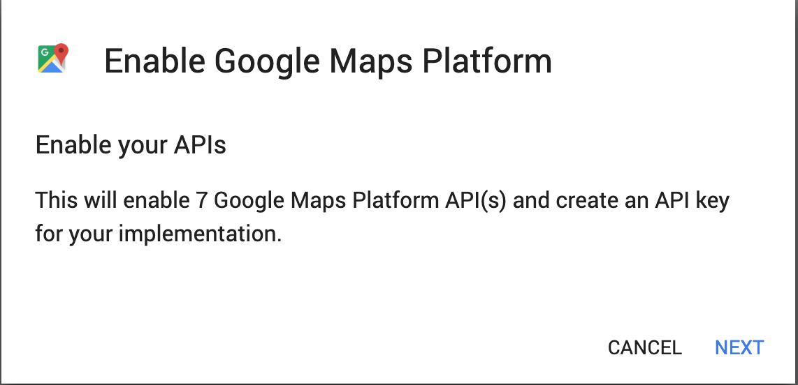

# Lesson 4 - Food Finder: Google Maps & URL Launcher
We are implementing a very basic version of Yelp in this lesson. You will learn about how to integrate Google Maps and open website urls in your Flutter app!

## Part 1 - Get the Google Maps API Key
Navigate your web browser to [Google Cloud Maps Platform](https://cloud.google.com/maps-platform/)


Click get started


Select `Maps` and click `continue`


Create a new project, give it a name, agree to Google's Terms of Service, and click `next`


You might need to setup your billing information with your credit/debit card. You also get $300 credits for free! If you don't have a credit/debit card, ask me for an API key.



After your billing account has been setup, click `next` to create your key! You Google Maps API key should be displayed on the next screen.

## Part 2 - Integrate Google Map
Now we can install Google Maps plugin to our flutter app and define our API key.

Start by creating a new Flutter project in your `Android Studio`

In your `pubspec.yaml`, add the following as an entry under `dependencies`.
```yaml
google_maps_flutter: ^0.2.0+3
```
Near the top of your editor, click the blue text `Packages get` to install the newly added `google_maps_flutter` package

After `google_maps_flutter` has been installed, we should add our API key. The API key needs to be defined for android and iOS separately depending on which platform you want to use. 

### Android
Open `android/app/src/main/AndroidManifest.xml`
Add the following just above/before `</application>`
```xml
<meta-data android:name="com.google.android.geo.API_KEY"
            android:value="YOUR GOOGLE MAPS API KEY"/>
```

### iOS
Open `ios/Runner/AppDelegate.m`, add
```smalltalk
#import "GoogleMaps/GoogleMaps.h"
```
just below 
```smalltalk
#include "GeneratedPluginRegistrant.h"
```

And then also add 
```smalltalk
[GMSServices provideAPIKey:@"YOUR GOOGLE MAPS API KEY"];
```

just above 
```smalltalk
[GeneratedPluginRegistrant registerWithRegistry:self];
```

Finally, open `ios/Runner/Info.plist` and add
```plist
<key>io.flutter.embedded_views_preview</key>
<string>YES</string>
```

just above `</dict>`

Now you can finally add the Google Maps widget in your `Flutter` app!

## Part 3 - Add restaurants display
In `lib/main.dart`, replace everything with the following
```dart
import 'package:flutter/material.dart';

void main() => runApp(MyApp());

class MyApp extends StatelessWidget {
  @override
  Widget build(BuildContext context) {
    return MaterialApp(
      title: 'Food Finder',
      theme: ThemeData(
        primarySwatch: Colors.red,
      ),
      debugShowCheckedModeBanner: false,
      home: MyHomePage(),
    );
  }
}
``` 

Let's import `google_maps_flutter` with
```dart
import 'package:google_maps_flutter/google_maps_flutter.dart';
```

Define our `MyHomePage` class
```dart
class MyHomePage extends StatelessWidget {
  GoogleMapController mapController;

  void _onMapCreated(GoogleMapController controller) {
    mapController = controller;
  }

  @override
  Widget build(BuildContext context) {
    return Scaffold(
      body: GoogleMap(
        onMapCreated: _onMapCreated,
        initialCameraPosition: const CameraPosition(
          target: LatLng(34.021574, -118.286659),
          zoom: 15,
        ),
      ),
    );
  }
}
```
`MyHomePage` class creates a `GoogleMap` widget in a `Scaffold`. We also defined an initial position and zoom for our map's camera. 

Run your app, and you should see a Google Map centered at USC on the screen!

Let's add a floating action button in our app. Add the following below `body` of `Scaffold` in the `build` function of `MyHomePage`
```dart
floatingActionButton: FloatingActionButton(
  onPressed: () => {},
  child: Icon(Icons.restaurant),
),
```

Right now the button shows on the screen at bottom right, but it doesn't do anything yet. Let's work on that by adding some restaurants data.

Create `Restaurant` class after `MyHomePage` class:
```dart
class Restaurant {
  final String name, desc, url;
  final double lat, lng, zoom;

  Restaurant({this.name, this.desc, this.url, this.lat, this.lng, this.zoom});
}
```

Define a list of restaurants as a member variable of `MyHomePage` class:
```dart
RestauranList<Restaurant> restaurants = [
  Restaurant(
    name: "Panda Express",
    desc: "Panda Express at The Ronald Tutor Campus Center features USC’s acclaimed and award-winning modern Chinese cuisine. Reflective of USC's passion for Asian ingredients and cooking techniques, the cuisine is accompanied by polished service, opulent, contemporary décor and spectacular campus panoramas",
    url: "https://www.pandaexpress.com/",
    lat: 34.020519,
    lng: -118.286339,
    zoom: 15
  ),
  Restaurant(
    name: "Honeybird",
    desc: "Sunny, streamlined spot for buttermilk-brined fried chicken, plus salads, side dishes & mini pies.",
    url: "https://www.honeybirdla.com/",
    lat: 34.024744,
    lng: -118.284417,
    zoom: 15
  ),
  Restaurant(
      name: "Cava",
      desc: "CAVA is a growing Mediterranean culinary brand with a flavorful and healthy fast-casual restaurant experience featuring customizable & craveable salads, grain bowls, pitas, and house-made juices. CAVA’s chef-crafted dips and spreads are available at Whole Foods Market and other specialty markets across the country.",
      url: "https://cava.com/",
      lat: 34.024902,
      lng: -118.284582,
      zoom: 15
  ),
  Restaurant(
      name: "Chick-fil-A",
      desc: "Fast-food chain serving chicken sandwiches, strips & nuggets along with salads & sides.",
      url: "http://www.chick-fil-a.com/usc",
      lat: 34.016617,
      lng: -118.282555,
      zoom: 15
  ),
];
```

Also define a `Marker` variable and an int in `MyHomePage` to track the current restaurant data we are using
```dart
Marker markerPrev;
int currRestaurant;
```

We are going to be using states in `MyHomePage`, so convert the class to a `StatefulWidget` (Hover your cursor on `MyHomePage`, click the light bulb, and then click `Convert to StatefulWidget`)

Next, define a function in `MyHomePageState`
```dart
void _showRandomRestaurant() async {
  this.setState(() {
    final _random = new Random();
    int next = 0;
    while((next = _random.nextInt(this.restaurants.length)) == this.currRestaurant);
    this.currRestaurant = next;
  });

  var r = this.restaurants[this.currRestaurant];
  this.mapController.animateCamera(
    CameraUpdate.newLatLngZoom(
      LatLng(r.lat, r.lng),
      r.zoom,
    ),
  );
  var marker = await this.mapController.addMarker(MarkerOptions(
    position: LatLng(r.lat, r.lng),
    visible: true,
    //infoWindowText: InfoWindowText(r.name, r.desc),
  ));
  if (this.markerPrev != null) {
    this.mapController.removeMarker(this.markerPrev);
  }
  this.markerPrev = marker;
}
```
and connect it to the floating action button we created earlier
```dart
floatingActionButton: FloatingActionButton(
  onPressed: _showRandomRestaurant,
  child: Icon(Icons.restaurant),
),
```

To make it work, we also need to import dart's math library
```dart
import 'dart:math';
```

Everything should be self-explanatory. When the user taps on the floating action button, we randomly select a restaurant from our list, animate the map's camera to the location of the restaurant, and add a marker to the screen. If a previous marker exists, we want to remove it.

Unfortunately, support for marker label in `google_maps_flutter` is unstable, so we need to make our own labels to display some basic restaurant information.

Add the following function in `MyHomePageState` class
```dart
Widget _buildInfoCard(BuildContext context) {
  return this.currRestaurant == null ? Container() : SafeArea(
    child: Container(
      width: double.infinity,
      padding: EdgeInsets.all(30.0),
      child: Card(
        child: Container(
          padding: EdgeInsets.fromLTRB(15, 15, 15, 0),
          child: Column(
            mainAxisSize: MainAxisSize.min,
            crossAxisAlignment: CrossAxisAlignment.start,
            children: [
              Text(
                this.restaurants[this.currRestaurant].name,
                style: TextStyle(
                  fontSize: 30,
                  fontWeight: FontWeight.w600,
                ),
              ),
              Container(
                height: 10,
              ),
              Text(
                this.restaurants[this.currRestaurant].desc,
              ),
              ButtonTheme.bar(
                child: ButtonBar(
                  children: <Widget>[
                    FlatButton(
                      child: const Text('WEBSITE'),
                      onPressed: () { },
                    ),
                  ],
                ),
              ),
            ]
          ),
        ),
      ),
    ),
  );
}
```

Also change the `body` of our `Scaffold` to 
```dart
Stack(
  children: [
    GoogleMap(
      onMapCreated: _onMapCreated,
      initialCameraPosition: const CameraPosition(
        target: LatLng(34.021574, -118.286659),
        zoom: 15,
      ),
    ),
    _buildInfoCard(context),
  ],
),
```

Now whenever a restaurant has been chosen, we also display its data on the screen!

## Part 4 - Integrate URL Launcher
Congratulations, you have reached the easiest part of this lesson.
Right now, if you tap on `website` on the restaurant info card, it does nothing. We want to make it open a link in the web browser on tap.

You should know how to install packages by now. Try installing `url_launcher`
```yaml
url_launcher: ^5.0.1
```

Don't forget to import it in `main.dart`
```dart
import 'package:url_launcher/url_launcher.dart';
```

Define the url launching function in `MyHomePageState` class
```dart
_launchURL(url) async {
  if (await canLaunch(url)) {
    await launch(url);
  } else {
    throw 'Could not launch $url';
  }
}
```

Finally, redefine the onPressed button for our website link. Can you find where that is?
```dart
onPressed: () { _launchURL(this.restaurants[this.currRestaurant].url); },
```

All done! You now have a working mini yelp app 😃! If you still can't get it to work, please ask us for help! As always, the finished code is in the `finished-code` folder. However, you still need to fill-in the `Google Maps API Key` in the configuration files (The property is defined, but not the actual key).
## Bonus Challenges
* Figure out how to use the satellite map view
* Add more restaurants?
* Add a `drawer` in `Scaffold` to display all the available restaurants
